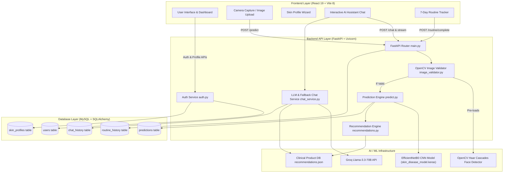

# AI Skin Intelligence – Personalized Skincare Recommendation System

[](https://www.python.org/)
[](https://fastapi.tiangolo.com/)
[](https://tensorflow.org/)
[](https://react.dev/)
[](https://vitejs.dev/)
[](https://www.mysql.com/)

An end-to-end intelligent dermatological assessment and personalized skincare planning web application. The platform leverages a deep learning Convolutional Neural Network (CNN) powered by **EfficientNetB0**, multi-signal Computer Vision validation layers via **OpenCV**, and an LLM-driven AI Skincare Assistant to analyze user skin condition photos and deliver personalized skincare routines, 7-day action plans, product recommendations, and progress tracking.

---

## Table of Contents

- [Project Overview](#project-overview)
- [Key Features](#key-features)
- [System Architecture](#system-architecture)
- [AI/ML System](#aiml-system)
  - [Model Architecture](#model-architecture)
  - [Supported Skin Classes](#supported-skin-classes)
  - [Image Processing & Prediction Pipeline](#image-processing--prediction-pipeline)
  - [Model Evaluation Results](#model-evaluation-results)
- [Personalization Pipeline](#personalization-pipeline)
- [AI Assistant](#ai-assistant)
- [Technology Stack](#technology-stack)
- [Project Structure](#project-structure)
- [Installation & Setup](#installation--setup)
  - [Prerequisites](#prerequisites)
  - [Database Setup](#database-setup)
  - [Backend Setup](#backend-setup)
  - [Frontend Setup](#frontend-setup)
- [API Endpoints](#api-endpoints)
- [Testing](#testing)
- [Screenshots / Demo](#screenshots--demo)
- [Project Development & Future Work](#project-development--future-work)
- [Disclaimer](#disclaimer)

---

## Project Overview

**AI Skin Intelligence** bridges dermatological image classification with personalized skincare routines. Users can capture or upload photos of their facial skin or affected skin areas to receive:

1. **Automated AI Skin Analysis**: Instant machine learning classification across 6 common skin conditions and baseline states.
2. **Multi-Signal Image Quality Assurance**: Real-time pre-filtering of dark, blurry, non-skin, foliage, landscape, or high-density object photos before running neural inference.
3. **Personalized Skincare Recommendations**: Targeted morning and night routines tailored to the user's specific skin condition, age group, and skin type (**Oily**, **Dry**, **Combination**, **Normal**, **Sensitive**).
4. **7-Day Regimen & Routine Tracker**: Day-by-day skincare routine execution tracking with status persistence.
5. **Dermatology AI Assistant**: Conversational AI assistant with streaming support, loaded with user skin profile context and database-backed clinical product suggestions.

---

## Key Features

- 🔬 **AI Skin Condition Classification**: Fast image analysis powered by transfer learning with an EfficientNetB0 backbone.
- 🛡️ **Out-of-Distribution (OOD) & Image Quality Guardrails**: OpenCV multi-signal pre-validation (lighting, sharpness, YCbCr+HSV skin color distribution, face detection, landscape/object rejection) and Softmax probability margin thresholds.
- 👤 **Comprehensive User Skin Profile**: Age, skin type (Oily, Dry, Combination, Normal, Sensitive), primary concerns, allergies, skin sensitivity level, sleep hours, water intake, lifestyle, and environmental exposure.
- 🧴 **Clinical Product Recommendations**: Detailed product catalog matches specifying active ingredients, pricing, usage instructions, and dermatological rationales.
- 📅 **7-Day Skincare Plan**: Structured weekly morning and evening routines with interactive completion checkboxes saved to the MySQL database.
- 💬 **Context-Aware AI Skincare Assistant**: LLM-powered chatbot (via Groq `llama-3.3-70b-versatile` with local fallback) that answers user questions using active skin analysis data, skin profile settings, and past analysis history.
- 📊 **Analysis History & Progress Tracking**: Persistent records of previous skin evaluations, confidence scores, and past recommended regimens.
- 🔐 **Secure Authentication**: JWT-based email/password authentication alongside Google OAuth 2.0 integration.

---

## System Architecture



---

## AI/ML System

### Model Architecture

The core vision module is implemented in TensorFlow / Keras and developed in [`skin_care.ipynb`](file:///c:/Users/AKHIL/OneDrive/Documents/AI%20skin%20care/AI-Skin-Intelligence-Personalized-Skincare-Planner/skin_care.ipynb).

- **Base Architecture**: `EfficientNetB0` pre-trained on ImageNet.
- **Preprocessing**: Built-in `Rescaling(1/255.0)` with standard input dimensions of `(224, 224, 3)`.
- **Classification Head**:
  - `Dropout(0.3)`
  - `Dense(256, activation="relu")`
  - `Dropout(0.3)`
  - `Dense(6, activation="softmax")`

### Supported Skin Classes

The model classifies input images into one of six distinct categories:

| Class Index | Condition Name | Description |
| :--- | :--- | :--- |
| `0` | **Acne** | Papules, pustules, comedones, and inflammatory acne lesions. |
| `1` | **Dark Spots** | Hyperpigmentation, post-inflammatory spots, and sun spots. |
| `2` | **Eczema** | Atopic dermatitis, dry patches, and skin barrier compromise. |
| `3` | **Normal** | Balanced, healthy skin with no major active inflammatory disease. |
| `4` | **Rosacea** | Erythema, persistent facial redness, and micro-vascular flushing. |
| `5` | **Wrinkles** | Fine lines, collagen loss, and aging skin texture. |

### Image Processing & Prediction Pipeline

```
[User Image]
     │
     ▼
[OpenCV Image Validation Layer] ──(Fails Quality/Content Check)──► [Return 200 with Warning Message]
     │ (Passes Brightness, Sharpness, Skin Ratio & Object Check)
     ▼
[Resizing & Preprocessing (224x224 RGB)]
     │
     ▼
[EfficientNetB0 CNN Model Inference]
     │
     ▼
[OOD & Confidence Gate]
(Top-1 Prob >= 45% AND Margin Top-1 - Top-2 >= 10%)
  ├── No  ──► [Return Ambiguous / Low Confidence Response]
  └── Yes ──► [Retrieve Recommendation Data & Persist to MySQL]
```

1. **Validation Phase** ([`image_validator.py`](file:///c:/Users/AKHIL/OneDrive/Documents/AI%20skin%20care/AI-Skin-Intelligence-Personalized-Skincare-Planner/backend/services/image_validator.py)): Evaluates image lighting (Luminance `35-242`), sharpness (Laplacian variance `≥18`), face presence (Haar frontal & profile cascades), dual-space skin color distribution (YCbCr + HSV), green/blue landscape rejection (`>22%`), and Canny edge density (`>28%`).
2. **Inference Phase** ([`predict.py`](file:///c:/Users/AKHIL/OneDrive/Documents/AI%20skin%20care/AI-Skin-Intelligence-Personalized-Skincare-Planner/backend/predict.py)): Runs model prediction on `skin_disease_model.keras`.
3. **Softmax Margin Gate**: Rejects ambiguous inputs if top-1 probability is below 45% or top-1 vs top-2 confidence margin is less than 10%.
4. **Recommendation Resolution**: Loads clinical product data and regimen rules from [`recommendations.json`](file:///c:/Users/AKHIL/OneDrive/Documents/AI%20skin%20care/AI-Skin-Intelligence-Personalized-Skincare-Planner/backend/recommendations.json).

### Model Evaluation Results

Model training and evaluation metrics recorded in [`skin_care.ipynb`](file:///c:/Users/AKHIL/OneDrive/Documents/AI%20skin%20care/AI-Skin-Intelligence-Personalized-Skincare-Planner/skin_care.ipynb):

- **Training Accuracy**: ~90.53% (Epoch 10 fine-tuning)
- **Validation Accuracy**: 81.46% (Fine-tuning validation peak)
- **Held-Out Test Set Evaluation** (804 images across 6 classes):
  - **Test Accuracy**: **92.29%**
  - **Test Loss**: **0.2060**

---

## Personalization Pipeline

```
Skin Image + Age + Skin Type ──► Skin Condition Prediction ──► Personalized Recommendations ──► 7-Day Plan
```

The system combines image-derived predictions with user profile telemetry:

1. **Input Stage**: The user captures a skin photo and completes their profile (Age, Skin Type, Sensitivity, Allergies, Lifestyle).
2. **Classification Stage**: The CNN identifies the primary skin condition (e.g., *Acne* or *Rosacea*).
3. **Recommendation Engine**: [`recommendations.py`](file:///c:/Users/AKHIL/OneDrive/Documents/AI%20skin%20care/AI-Skin-Intelligence-Personalized-Skincare-Planner/backend/recommendations.py) combines predicted condition data with skin type parameters (Oily, Dry, Combination, Normal, Sensitive) to select safe active ingredients (e.g., Salicylic Acid for oily acne vs. Azelaic Acid for sensitive rosacea).
4. **Weekly Execution**: Generates a tailored 7-day morning and evening routine schedule accessible via the Weekly Plan UI.

---

## AI Assistant

The AI Assistant ([`chat.py`](file:///c:/Users/AKHIL/OneDrive/Documents/AI%20skin%20care/AI-Skin-Intelligence-Personalized-Skincare-Planner/backend/chat.py) & [`chat_service.py`](file:///c:/Users/AKHIL/OneDrive/Documents/AI%20skin%20care/AI-Skin-Intelligence-Personalized-Skincare-Planner/backend/services/chat_service.py)) delivers personalized skincare support:

- **Context Integration**: Dynamically injects user age, skin type, primary concerns, allergies, recent CNN predictions, and previous conversation history into system prompts.
- **LLM Engine**: Powered by Groq's `llama-3.3-70b-versatile` with Server-Sent Events (SSE) streaming (`POST /chat/stream`).
- **Domain Guardrails**: Enforces strict dermatological topic boundaries; non-skincare queries are politely declined.
- **Local Fallback Engine**: If the LLM service is offline or unconfigured, the assistant falls back to local structured recommendations from the clinical product catalog.
- **Weekly Plan Integration**: Answers routine and ingredient questions directly grounded in the user's generated weekly plan and skin condition context.

---

## Technology Stack

### Frontend
- **Framework**: React 19 (`react` 19.2.7) + Vite 8 (`vite` 8.1.1)
- **Styling**: Vanilla CSS / Tailwind CSS v4 (`@tailwindcss/vite` 4.3.2)
- **UI & Iconography**: Lucide React (`lucide-react`), React Icons (`react-icons`), Framer Motion (`framer-motion`)
- **Data Visualization**: Recharts (`recharts` 3.9.1)
- **Routing & Auth**: React Router v7 (`react-router-dom`), `@react-oauth/google`

### Backend
- **Framework**: FastAPI (`fastapi` 0.115.0)
- **ASGI Server**: Uvicorn (`uvicorn` 0.31.0)
- **Language**: Python 3.10+
- **Data Validation & Schemas**: Pydantic

### AI / ML & Computer Vision
- **Deep Learning**: TensorFlow (`tensorflow` >=2.16.0), Keras (EfficientNetB0)
- **Computer Vision**: OpenCV (`opencv-python-headless` >=4.9.0)
- **Data & Image Processing**: NumPy (`numpy` >=1.26.4), Pillow (`pillow` 10.4.0)
- **LLM Integration**: Groq API (`groq`, model: `llama-3.3-70b-versatile`)

### Database & Security
- **Database**: MySQL Server 8.0+
- **ORM & Driver**: SQLAlchemy, PyMySQL (`pymysql`)
- **Authentication**: PyJWT (`pyjwt`), Bcrypt (`bcrypt`, `passlib`)

---

## Project Structure

```
AI-Skin-Intelligence-Personalized-Skincare-Planner/
├── backend/                        # FastAPI Backend Application
│   ├── models/                     # SQLAlchemy Database Models & Keras Model
│   │   ├── base.py                 # Declarative Base
│   │   ├── user.py                 # User Account Model
│   │   ├── skin_profile.py         # Skin Profile Model
│   │   ├── prediction.py           # Prediction History Model
│   │   ├── routine.py              # 7-Day Routine Tracking Model
│   │   ├── chat.py                 # Chat History Model
│   │   └── skin_disease_model.keras # Trained TensorFlow/Keras EfficientNetB0 Model
│   ├── services/                   # Business & Vision Services
│   │   ├── image_validator.py      # OpenCV Multi-Signal Image Validation
│   │   └── chat_service.py         # Groq LLM & Fallback Chat Engine
│   ├── auth.py                     # Authentication Router (Register, Login, Google OAuth, Profile)
│   ├── chat.py                     # AI Chat Assistant Router & SSE Streams
│   ├── database.py                 # MySQL Engine & Session Management
│   ├── main.py                     # FastAPI Application Entrypoint & Middleware
│   ├── predict.py                  # Model Loader & Prediction Pipeline
│   ├── recommendations.py          # Clinical Recommendation Data Loader
│   ├── recommendations.json        # Database of Conditions & Products
│   ├── requirements.txt            # Python Dependencies
│   └── test_prediction_pipeline.py # Pytest Suite for Vision & API Validation
├── src/                            # React 19 Frontend Source Code
│   ├── assets/                     # Graphic Assets & SVG Icons
│   ├── auth/                       # Auth Context & Hooks
│   ├── components/                 # Reusable UI Components & Modals
│   │   ├── CameraModal.jsx         # Live Webcam Capture Modal
│   │   ├── FloatingAIAssistant.jsx # Global AI Chat Drawer
│   │   ├── SkinProfileWizardModal.jsx # Personalization Setup Wizard
│   │   ├── CompareProductsModal.jsx   # Product Comparison Matrix
│   │   └── ProgressChart.jsx       # Recharts Skin Score Visualizer
│   ├── layouts/                    # Main Marketing & Dashboard Layouts
│   ├── pages/                      # Application Page Views
│   │   ├── SkinAnalysis.jsx        # Image Upload & Real-Time Classification Page
│   │   ├── Recommendations.jsx     # Product & Routine Recommendations View
│   │   ├── WeeklyPlan.jsx          # 7-Day Interactive Skincare Routine
│   │   ├── Dashboard.jsx           # User Overview & Stats
│   │   ├── Progress.jsx            # Progress Analytics & History Charts
│   │   ├── Profile.jsx             # User Profile & Skin Attributes Form
│   │   └── Chat.jsx                # Full-Page AI Dermatology Assistant
│   ├── App.jsx                     # Route Configuration
│   └── main.jsx                    # React Application Mounting
├── public/                         # Public Static Assets
├── skin_care.ipynb                 # Model Training, Fine-Tuning & Evaluation Notebook
├── package.json                    # Frontend Package Configuration
├── vite.config.js                  # Vite Build Configuration
└── README.md                       # Project Documentation
```

---

## Installation & Setup

### Prerequisites

- **Node.js**: v18.x or higher
- **Python**: v3.10 or higher
- **MySQL Server**: v8.0 or higher running locally or remotely

### Database Setup

1. Open your MySQL client (e.g., MySQL Workbench, Command Line) and create the database:
   ```sql
   CREATE DATABASE ai_skin_intelligence;
   ```
2. Verify MySQL credentials. Standard database URL configured in [`backend/database.py`](file:///c:/Users/AKHIL/OneDrive/Documents/AI%20skin%20care/AI-Skin-Intelligence-Personalized-Skincare-Planner/backend/database.py):
   ```
   mysql+pymysql://<DB_USER>:<DB_PASSWORD>@localhost:3306/ai_skin_intelligence
   ```

### Backend Setup

1. Navigate into the `backend/` directory:
   ```bash
   cd backend
   ```
2. Create and activate a Python virtual environment:
   ```bash
   # Windows (PowerShell)
   python -m venv .venv
   .\.venv\Scripts\Activate.ps1

   # Linux/macOS
   python3 -m venv .venv
   source .venv/bin/activate
   ```
3. Install backend dependencies:
   ```bash
   pip install -r requirements.txt
   ```
4. Create a `.env` file inside the root directory or `backend/` folder:
   ```env
   GROQ_API_KEY=your_groq_api_key_here
   SECRET_KEY=your_custom_jwt_secret_key
   ```
5. Start the FastAPI development server:
   ```bash
   uvicorn main:app --reload --host 127.0.0.1 --port 8000
   ```
   The backend API will run at `http://127.0.0.1:8000` (Swagger docs available at `http://127.0.0.1:8000/docs`).

### Frontend Setup

1. Open a new terminal in the project root directory.
2. Install Node dependencies:
   ```bash
   npm install
   ```
3. Start the Vite development server:
   ```bash
   npm run dev
   ```
4. Open your browser and navigate to `http://localhost:5173`.

---

## API Endpoints

### Skin Analysis & Prediction

| Method | Endpoint | Description |
| :--- | :--- | :--- |
| `POST` | `/predict` | Accepts image file (`multipart/form-data`). Runs OpenCV validation layer followed by CNN classification and recommendation mapping. |
| `GET` | `/predictions/history` | Fetches historical skin classification records for the authenticated user. |
| `DELETE` | `/predictions/history/{id}` | Removes a specific prediction record from history. |

### Authentication & User Profile

| Method | Endpoint | Description |
| :--- | :--- | :--- |
| `POST` | `/auth/register` | Registers a new user account and initializes a default skin profile. |
| `POST` | `/auth/login` | Authenticates email/password credentials and returns a JWT token. |
| `POST` | `/auth/google` | Authenticates or registers users via Google OAuth 2.0. |
| `GET` | `/auth/me` | Retrieves the profile details of the current logged-in user. |
| `GET` | `/auth/profile` | Retrieves current user's personalized skin attributes. |
| `POST` | `/auth/profile` | Updates skin profile parameters (age, skin type, sensitivity, allergies, habits). |

### AI Assistant & Routines

| Method | Endpoint | Description |
| :--- | :--- | :--- |
| `POST` | `/chat` | Submits a question to the AI Skincare Assistant and returns a complete response. |
| `POST` | `/chat/stream` | Streams AI Assistant responses in real time using Server-Sent Events (SSE). |
| `GET` | `/chat/history` | Retrieves stored conversation history for context continuity. |
| `DELETE` | `/chat/history` | Clears stored chat history for the user. |
| `POST` | `/routine/complete` | Updates completion state for a daily routine item. |
| `GET` | `/routine/history` | Retrieves historical routine completion records. |

---

## Testing

The backend includes automated test coverage implemented using Pytest and FastAPI's `TestClient` in [`test_prediction_pipeline.py`](file:///c:/Users/AKHIL/OneDrive/Documents/AI%20skin%20care/AI-Skin-Intelligence-Personalized-Skincare-Planner/backend/test_prediction_pipeline.py).

To execute the test suite:

```bash
cd backend
pytest -v
```

### Verified Test Cases

- **Case A (Clear Face Photo)**: Verifies that valid facial skin photos successfully reach CNN inference (`valid_image: true`).
- **Case B (Skin Disease Close-Up)**: Validates that unframed close-up photos of affected skin patches correctly pass the validation layer.
- **Case C (Landscape & Foliage Rejection)**: Confirms that green nature photos, foliage, and outdoor sunset photos are rejected (`valid_image: false`).
- **Case D (Object Grid Rejection)**: Verifies that photos containing high edge-density non-skin objects (e.g. keyboards, food) are rejected.
- **Case E (Blur Rejection)**: Confirms that images failing Laplacian variance thresholds (`<18.0`) are flagged with a blur warning.
- **Case F (Dark Lighting Rejection)**: Confirms that low-luminance images (`<35.0`) are rejected with lighting advice.
- **Case G (Low Confidence / Ambiguity Rejection)**: Verifies that ambiguous skin photos trigger OOD rejection rather than forcing an inaccurate disease classification.

---

## Screenshots / Demo

*Note: UI Screenshots can be added to this section after running the application locally.*

| Dashboard Overview | AI Skin Analysis |
| :---: | :---: |
| *[ Dashboard Placeholder ]* | *[ Skin Analysis Upload & Results Placeholder ]* |

| Personalized Recommendations | 7-Day Skincare Plan |
| :---: | :---: |
| *[ Product Recommendations Placeholder ]* | *[ Weekly Routine Planner Placeholder ]* |

---

## Project Development & Future Work

This system is developed as an advanced AI/ML portfolio and final-year engineering project.

### Future Work

- **Mobile Application Development**: Cross-platform mobile client built with React Native or Flutter.
- **Multi-Lesion Bounding-Box Detection**: Integrating YOLOv8/v10 models to localize and segment multiple simultaneous skin lesions in a single photo.
- **Edge AI Deployment**: Exporting the EfficientNetB0 model to TensorFlow Lite (TFLite) and ONNX for fast, on-device mobile inference.
- **Tele-Dermatology Integration**: Seamless export of analysis history reports for remote consultation with certified dermatologists.

---

## Disclaimer

> [!WARNING]
> **Medical Disclaimer**: AI Skin Intelligence is an artificial intelligence-based decision-support and educational tool designed solely for informational, skincare planning, and cosmetic support purposes. It is **not** a diagnostic medical device and does **not** provide professional medical diagnoses, treatment advice, or dermatological consultations. Always seek the advice of a qualified dermatologist or medical practitioner for any medical conditions or skin concerns.

---

## Author / Project Information

- **Project Title**: AI Skin Intelligence – Personalized Skincare Recommendation System
- **Repository**: [AI-Skin-Intelligence-Personalized-Skincare-Planner](file:///c:/Users/AKHIL/OneDrive/Documents/AI%20skin%20care/AI-Skin-Intelligence-Personalized-Skincare-Planner)
- **License**: MIT License
