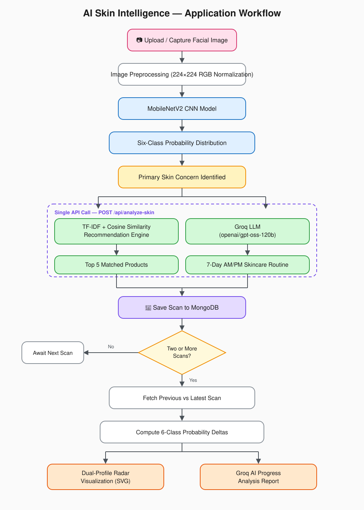
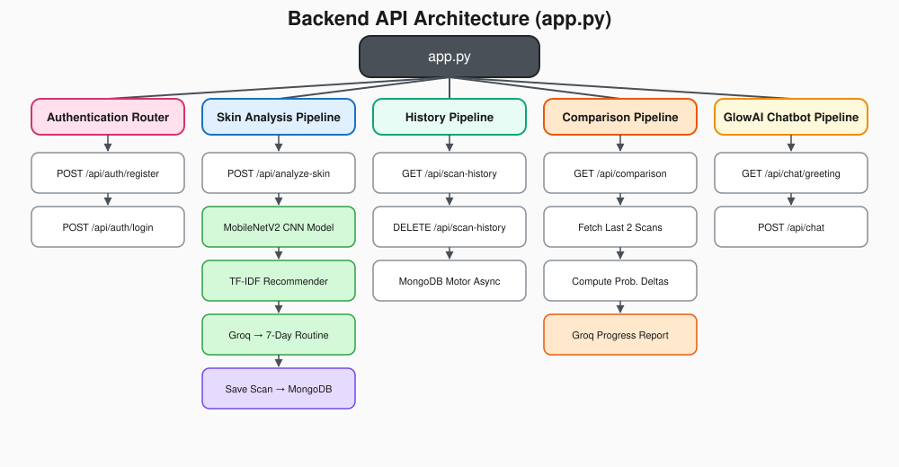
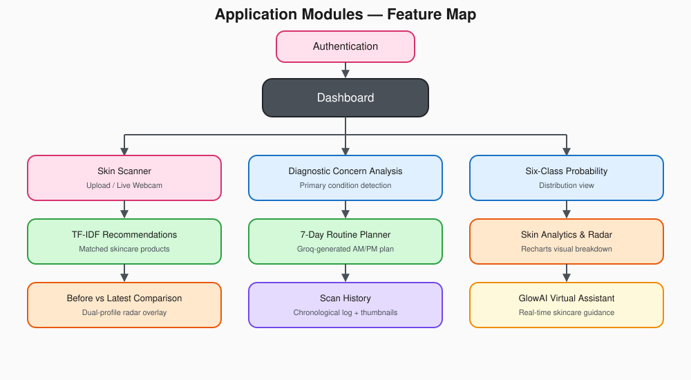

# AI Skin Intelligence & Personalized Skincare Planner

## Overview
A full-stack AI-powered facial skin analysis and personalized skincare planning application.

The system analyzes a user's facial image with a trained CNN model, identifies the most probable skin concern, displays the complete model probability distribution, recommends relevant skincare products using an NLP-based recommendation pipeline, generates personalized skincare routines with Groq, and compares previous and latest scans to visualize changes over time.

The application is designed as a facial skin analysis and decision-support system. Its model probabilities and generated recommendations are not clinically validated measurements or medical diagnoses.

## Core Workflow



All of the above — the primary concern, probability distribution, top 5 recommended products, and the 7-day routine — are returned together in a single response from `POST /api/analyze-skin`.

## Main Features

### 1. Authentication
- User registration and login with input validation
- Password hashing with bcrypt
- JWT-based authenticated sessions (python-jose)
- User-specific scan records and persistent database history
- Protected API endpoints and route guards

### 2. Facial Skin Analysis
- Upload an image file or capture live via webcam
- Image preprocessing with RGB conversion and tensor normalization
- Inference using a fine-tuned MobileNetV2 CNN classifier
- Confidence scoring and dynamic threshold evaluation
- Display of the complete six-class probability distribution
- A single analysis call returns the classification, top 5 recommended products, and the 7-day routine together

### 3. Six Skin Classes
The classification engine predicts across six distinct target classes:
- Acne
- Blackheads
- Clear Skin
- Dark Spots
- Puffy Eyes
- Wrinkles

### 4. Product Recommendation Engine
The recommendation system uses the project's curated skincare product dataset rather than hard-coded product recommendations. Skin concern and skin type are matched against `backend/data/skincare_products.csv` using TF-IDF vectorization on active ingredients and concerns, then ranked by cosine similarity score (see `backend/recommender.py`). The full pipeline is shown in the Core Workflow diagram above.

Recommendations are not fetched from a separate endpoint — they are generated as part of the skin analysis call and returned as `analysisData.recommended_products` from `POST /api/analyze-skin`, then rendered by `ProductCards.jsx`.

### 5. Personalized Skincare Routine
Groq (`openai/gpt-oss-120b`) generates a structured 7-day skincare routine based on the user's primary detected concern, age, gender, and skin type.

The routine is generated as part of the analysis call and returned as `analysisData.routine_7_day` from `POST /api/analyze-skin`. `Dashboard.jsx` passes this value down to `RoutinePlanner.jsx`, which renders it across:
- Morning (AM) protective routine
- Evening (PM) restorative routine
- Target active ingredient application
- Step-by-step application order
- General precautions and patch-test guidelines

### 6. Skin Progress Comparison
The comparison module tracks multi-session progress across the user's two most recent scans — computing six-class probability deltas, rendering a dual-profile radar overlay, and generating a Groq-based comparative progress report. This pipeline is also shown in the Core Workflow diagram above.

Features included:
- Before and latest scan visual previews
- Primary condition transition detection
- Confidence delta tracking
- Favorable vs. unfavorable probability change calculation
- Six-axis Before vs. Latest overlay radar chart
- Groq-generated comparative AI progress report
- One-click real-time data refresh

**Important:** Probability changes represent AI model outputs. They should not be interpreted as clinically validated measurements of skin improvement.

### 7. Analysis History
Persistent historical scan logs are stored in MongoDB and associated with the authenticated user.
- Chronological log of all past diagnostic uploads
- Thumbnail image rendering with base64/URL fallbacks
- Classification records with score metrics and timestamps
- Single-click complete history reset with confirmation safeguards

### 8. GlowAI Chatbot
The application includes the GlowAI interactive assistant for real-time skincare guidance, ingredient explanations, and routine advice powered by Groq.

## Technology Stack

**Frontend**
- React 19
- Vite
- Tailwind CSS v4
- Lucide React
- Recharts
- Axios
- React-Markdown

**Backend**
- Python 3.10+
- FastAPI
- Uvicorn
- Pydantic
- MongoDB Atlas
- Motor (Async MongoDB Driver)
- PyMongo

**Machine Learning**
- TensorFlow 2.15.0
- Keras (MobileNetV2 Backbone)
- NumPy (< 2.0.0, >= 1.23.5)
- Pillow

**AI & LLM Inference**
- Groq API (`openai/gpt-oss-120b`)

**Recommendation System**
- Pandas
- Scikit-learn
- TF-IDF Vectorizer
- Cosine Similarity

**Authentication & Security**
- Bcrypt
- Python-Jose (JWT Tokens)
- Python-Dotenv
- Python-Multipart

## Project Structure
```
AI-Skin-Intelligence-Personalized-Skincare-Planner/
│
├── backend/
│   ├── data/
│   │   └── skincare_products.csv
│   │
│   ├── models/
│   │   └── facial_skin_model.keras
│   │
│   └── recommender.py
│
├── Datasets/
│   └── facial skin analysis training dataset
│
├── frontend/
│   ├── node_modules/
│   ├── public/
│   │
│   ├── src/
│   │   ├── assets/
│   │   │   ├── workflow-diagram.svg
│   │   │   ├── api-architecture.svg
│   │   │   ├── application-modules.svg
│   │   │   ├── hero.png
│   │   │   ├── react.svg
│   │   │   └── vite.svg
│   │   │
│   │   ├── components/
│   │   │   ├── AnalysisResult.jsx
│   │   │   ├── AnalyticsView.jsx
│   │   │   ├── ComparisonView.jsx
│   │   │   ├── GlowAIChatbot.jsx
│   │   │   ├── Header.jsx
│   │   │   ├── HistoryView.jsx
│   │   │   ├── Navbar.jsx
│   │   │   ├── ProductCards.jsx
│   │   │   ├── RoutinePlanner.jsx
│   │   │   ├── Sidebar.jsx
│   │   │   └── SkinScanner.jsx
│   │   │
│   │   ├── pages/
│   │   │   ├── AuthPage.jsx
│   │   │   └── Dashboard.jsx
│   │   │
│   │   ├── services/
│   │   │   └── api.js
│   │   │
│   │   ├── App.css
│   │   ├── App.jsx
│   │   ├── index.css
│   │   └── main.jsx
│   │
│   ├── eslint.config.js
│   ├── index.html
│   ├── package.json
│   ├── package-lock.json
│   └── vite.config.js
│
├── venv/
├── .env
├── .gitignore
├── app.py
├── face_analysis.ipynb
├── LICENSE
├── README.md
└── requirements.txt
```


## Backend API Architecture



## Machine Learning Model
The facial skin classification model is stored as:
```
backend/models/facial_skin_model.keras
```
The model architecture uses a MobileNetV2 backbone fine-tuned for transfer learning, outputting a softmax probability vector across 6 skin classes.

Example output vector:
```
Acne          → 74.0%
Blackheads    →  6.7%
Clear Skin    →  0.6%
Dark Spots    → 16.5%
Puffy Eyes    →  1.0%
Wrinkles      →  1.2%
```
The class with the maximum activation probability is designated as the primary classified target.

## Dataset
- **Training dataset:** Maintained in `Datasets/` for model development and transfer learning.
- **Model weights:** Serialized for runtime inference under `backend/models/facial_skin_model.keras`.
- **Skincare product catalog:** Located at `backend/data/skincare_products.csv` with ingredients, ratings, prices, and skin concerns.

## Installation

### 1. Clone the project
```bash
git clone <your-repository-url>
cd AI-Skin-Intelligence-Personalized-Skincare-Planner
```

### 2. Create and activate the Python environment

**Windows (PowerShell):**
```powershell
python -m venv venv
.\venv\Scripts\activate
```

**Linux / macOS:**
```bash
python3 -m venv venv
source venv/bin/activate
```

### 3. Install backend dependencies
```bash
pip install -r requirements.txt
```

### 4. Install frontend dependencies
```bash
cd frontend
npm install
```

## Environment Variables
Create a `.env` file in the project root directory:
```
SECRET_KEY=your_secure_custom_secret_key_here
ALGORITHM=HS256
ACCESS_TOKEN_EXPIRE_MINUTES=60
GROQ_API_KEY=your_groq_api_key_here
MONGO_URI=your_mongodb_connection_string_here
DB_NAME=skincare_db
```
**Security Note:** Never commit your `.env` file with active database credentials or API keys to any public GitHub repository. Ensure `.env` is listed in your `.gitignore`.

## Running the Application

### Start the FastAPI backend
From the project root directory (with virtual environment activated):
```bash
python -m uvicorn app:app --reload
```
The backend server will run at `http://127.0.0.1:8000`.

### Start the React frontend
Open a new terminal window:
```bash
cd frontend
npm run dev
```
The Vite development server will provide the local application URL (typically `http://localhost:5173`).

## API Documentation
When the FastAPI server is running, interactive API documentation is available at:
- **Swagger UI:** `http://127.0.0.1:8000/api/docs`
- **ReDoc:** `http://127.0.0.1:8000/api/redoc`

## Endpoints

| Method | Endpoint | Description |
|--------|----------|-------------|
| GET | `/` | Read Root |
| POST | `/api/auth/register` | Register |
| POST | `/api/auth/login` | Login |
| GET | `/api/scan-history` | Get Scan History |
| DELETE | `/api/scan-history` | Clear Scan History |
| POST | `/api/analyze-skin` | Analyze Skin (returns classification, recommend_products, and routine_7_day) |
| GET | `/api/comparison` | Get Comparison |
| GET | `/api/chat/greeting` | Get Chat Greeting |
| POST | `/api/chat` | Chat With Glowai |

## Important Files

| File | Purpose |
|------|---------|
| `app.py` | Main FastAPI backend & API routing |
| `backend/models/facial_skin_model.keras` | Trained MobileNetV2 CNN classifier |
| `backend/recommender.py` | TF-IDF product recommendation engine |
| `backend/data/skincare_products.csv` | Skincare product & ingredient dataset |
| `frontend/src/services/api.js` | Axios client with JWT interceptor |
| `frontend/src/pages/AuthPage.jsx` | Authentication (Login / Register) view |
| `frontend/src/pages/Dashboard.jsx` | Central dashboard & state coordinator |
| `frontend/src/components/SkinScanner.jsx` | Webcam capture & image upload interface |
| `frontend/src/components/AnalysisResult.jsx` | Classification metrics & vector bars |
| `frontend/src/components/AnalyticsView.jsx` | Recharts radar chart & analytics view |
| `frontend/src/components/ComparisonView.jsx` | Before vs. Latest SVG radar comparison |
| `frontend/src/components/ProductCards.jsx` | Matched skincare product recommendations |
| `frontend/src/components/RoutinePlanner.jsx` | 7-Day interactive skincare routine cards |
| `frontend/src/components/HistoryView.jsx` | Chronological scan logs & thumbnail viewer |
| `frontend/src/components/GlowAIChatbot.jsx` | Interactive Groq-powered AI chatbot |
| `requirements.txt` | Pinned Python package dependencies |
| `frontend/package.json` | Frontend dependencies & scripts |

## Application Modules



## Responsible Use
This application is intended for educational, research, and skincare-support purposes.

The CNN probabilities, product recommendations, and AI-generated text:
- are not medical diagnoses
- are not clinically validated measurements
- should not replace professional medical advice
- may vary depending on image quality, lighting, pose, and model behavior

Users should consult a qualified dermatologist or healthcare professional for medical concerns.

## Development Notes
The project enforces clean separation of concerns across its architectural layers:

- **Frontend** → User Interface + SVG/Recharts Visualizations
- **Backend** → RESTful API + JWT Authentication + Async MongoDB Operations
- **Machine Learning** → MobileNetV2 CNN Skin Classification
- **Recommendation Engine** → TF-IDF & Cosine Similarity Dataset Matching (returned inline with analysis)
- **Generative AI** → Groq (`openai/gpt-oss-120b`) Skincare Regimens & Comparison Reports
- **Database** → MongoDB Atlas User Profiles & Scan History Collections

## License
See the `LICENSE` file included in this repository.
